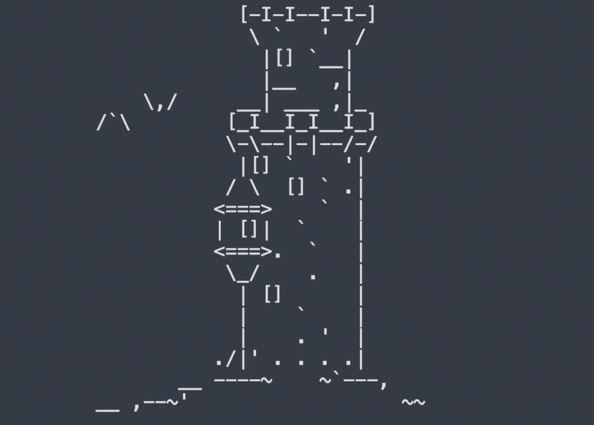

#Warrior JS

YouTube: (coming soon)

https://warriorjs.com/

WarriorJS is a fun way to practice and improve your software development skills. Write Javascript to instruct the warrior to battle enemies, rescue captives and make it to the stairs alive.

Legend tells of a legendary sword, forgotten to the ruins of an abandoned tower. Thousands of warriors have set off on a quest for the sword, whose bearer would become enlightened in the JavaScript language.

In this video we complete the first 6 levels of WarriorJS.
